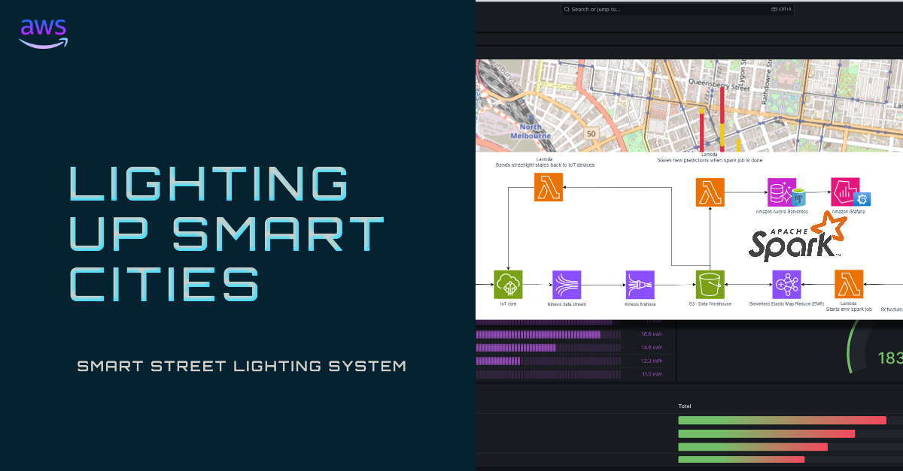
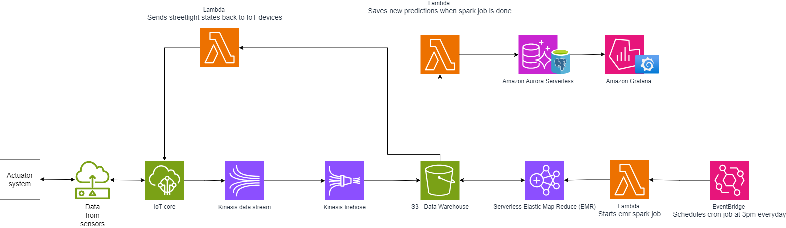
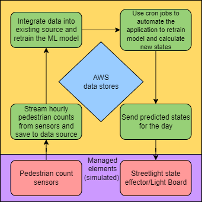
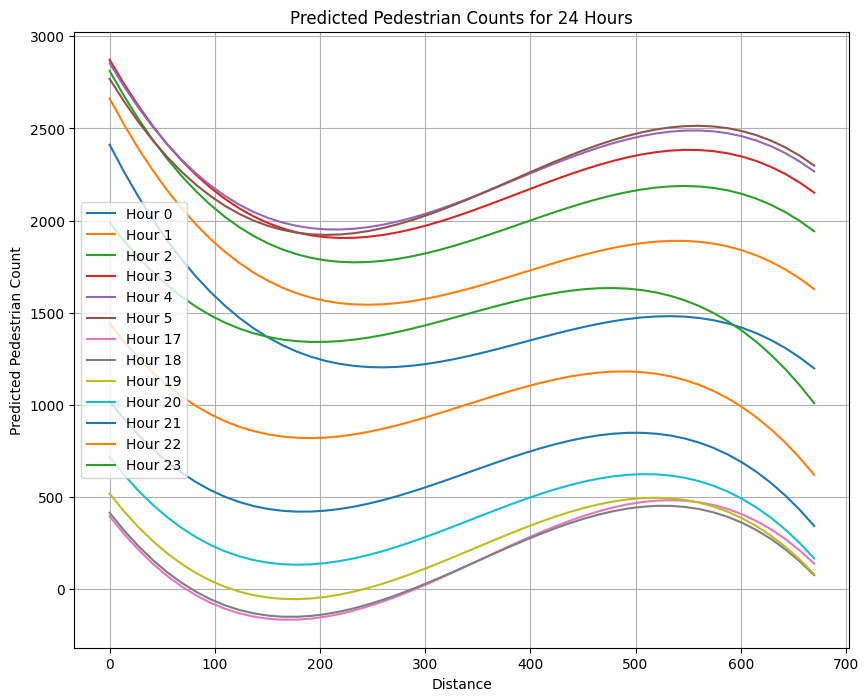
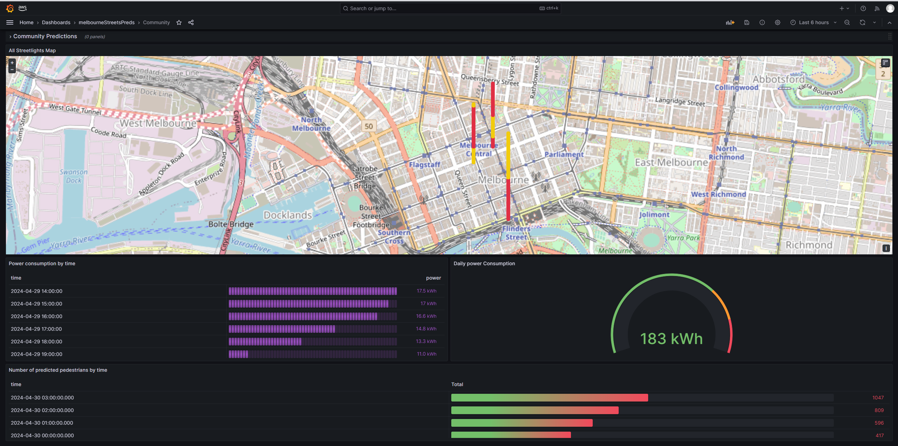
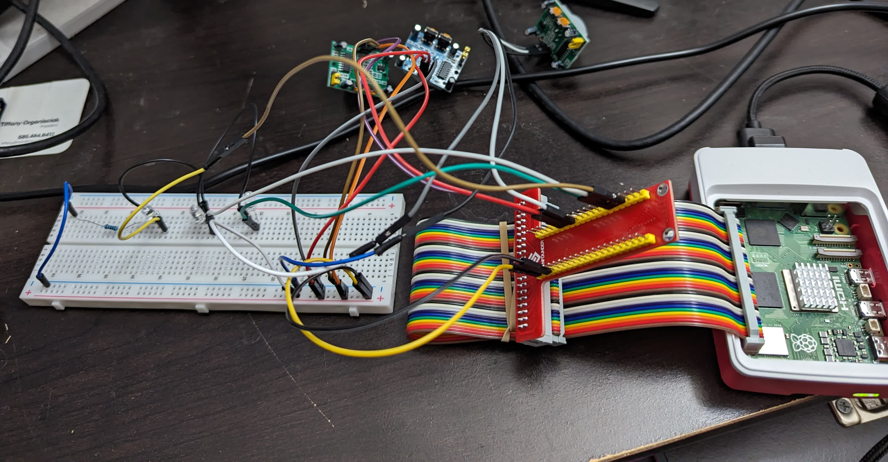
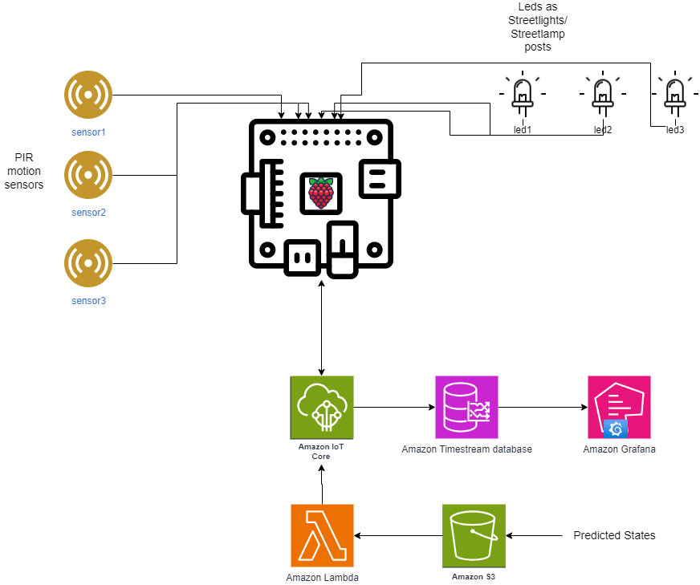
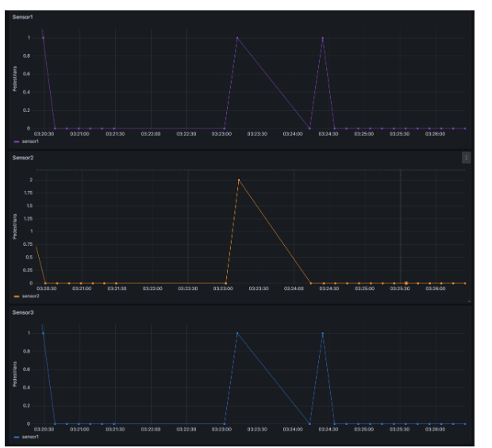
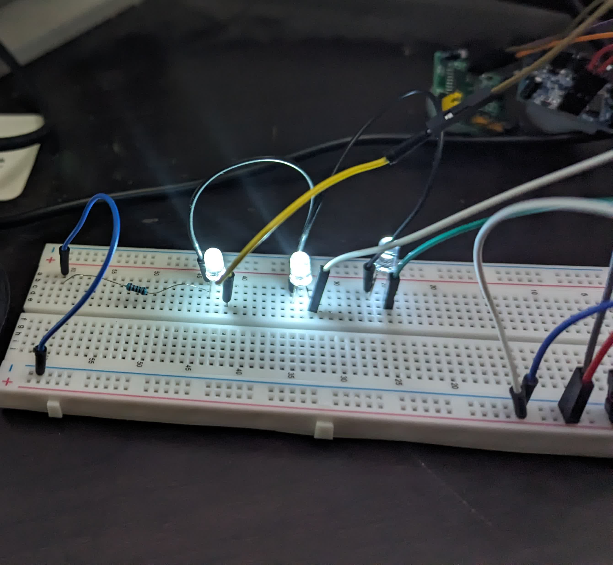

# 🌃 Adaptive Street Lights

**Data-driven, proactive street lighting for smart cities** — dimming and brightening street lamps ahead of demand by predicting pedestrian density, instead of reacting to motion after the fact.

  
   
  <a href="https://www.linkedin.com/pulse/engineering-smart-cities-street-lighting-system-jagrat-rao-km4df/"><b>📖 Read the full article on LinkedIn →</b></a>
   
  <i>The article covers the <b>cloud system</b> only — the actuator prototype is documented below in this README.</i>

---

## 📚 Table of Contents

- [Overview](#overview)
- [☁️ The Cloud System](#-the-cloud-system)
- [🔌 The Actuator System](#-the-actuatorphysical-system-prototype)

---

## Overview

Conventional street lighting runs at full power all night, burning energy nobody is using. This project takes a **proactive** rather than **reactive** approach: instead of waiting for a motion sensor to trip, it **predicts** how many pedestrians will be on each stretch of street, hour by hour, and sets each lamp to one of three states ahead of time:

| State | Brightness | Power draw |
| :--- | :--- | :--- |
| 🔆 `high` | 125% | high-traffic stretches |
| 💡 `regular` | 100% | normal traffic |
| 🌙 `dimmed` | 50% | low / no predicted traffic |

The system is built on the **MAPE-K** (Monitor–Analyze–Plan–Execute over a shared Knowledge base) self-adaptive architecture. Sensors stream hourly pedestrian counts to the cloud; a model retrains daily on the new data; the resulting predictions decide each lamp's state for the night. Because consumption is predicted ahead of time, the system also gives city planners a reliable **energy-budget forecast** — something traditional lighting can't offer.

Predictions and states are derived from the **[City of Melbourne Pedestrian Counting System](https://www.pedestrian.melbourne.vic.gov.au/)** dataset, which provides real hourly pedestrian counts from sensors across the city.

This repository documents the system in two parts:

1. **The cloud system** — the predictive MAPE-K pipeline on AWS that forecasts pedestrian density and decides each lamp's state for the night.
2. **The actuator system** — a physical Raspberry Pi prototype of the on-street hardware that receives those states and drives the lamps.

Together they form the full loop: the cloud predicts, the hardware acts.

---

## ☁️ The Cloud System

A serverless, city-scale data pipeline designed around two quality attributes: **scalability** (thousands of sensors, GB/s of data) and **availability** (fault-tolerant, self-healing, multi-AZ).

### Goals

- 📡 Stream sensor data from IoT devices in **real-time**
- 🔁 Implement a self-adaptive **MAPE-K** architecture on cloud infrastructure
- ⚙️ Handle large data volumes (GB/s) and run **ETL with Apache Spark on EMR**
- 📈 Predict future pedestrian counts with a **polynomial-regression model**

### Components

| AWS service | Role in the pipeline |
| :--- | :--- |
| **Actuator System** *(simulated)* | Streams pedestrian counts in; applies the returned lamp states |
| **AWS IoT Core** | MQTT bridge between sensors and the cloud |
| **Kinesis Data Streams + Firehose** | Ingest real-time sensor data, partition it into S3 |
| **S3 — Data Warehouse** | Stores raw counts and the daily prediction CSVs |
| **EMR Serverless (Apache Spark)** | Runs the ETL + prediction job over large data volumes |
| **EventBridge** | Cron trigger — kicks off the Spark job daily (3 pm) |
| **Lambda** | On new predictions: persist to Aurora **and** push states back to IoT Core |
| **Aurora Serverless (PostgreSQL)** | Stores model results; self-healing for high availability |
| **Amazon Managed Grafana** | Visualizes predictions, states, and energy use |

### MAPE-K loop

Sensors **monitor** pedestrian counts → Spark **analyzes** and predicts → the system **plans** lamp states for the night → Lambda **executes** by sending states back to the actuators → all coordinated over a shared **knowledge** store (S3 + Aurora). The Spark job retrains daily, so the system continuously adapts to changing pedestrian patterns.

### Prediction model

The model is a **degree-3 polynomial regression** fitted to pedestrian counts along a street's distance, at each hour. Streetlights have a ~15 m effective radius, so fixtures are placed at **15 m intervals**; the model predicts a count at each fixture's position for every hour from **6 pm to 8 am**, and percentile-maps those counts onto the `high` / `regular` / `dimmed` states.

**Energy accounting:** an average streetlight draws **0.1 kWh/hour** at `regular` (100%); `high` = 125% and `dimmed` = 50% scale from there, making nightly consumption fully predictable per street and per community.

### Visualization

Per-street predictions roll up into a community-wide view in Grafana — a live map of Melbourne with each lamp colored by predicted state, alongside the night's forecast energy draw.

---

## 🔌 The Actuator/Physical System Prototype

> *Smart City Streetlight IoT Actuator System*

The cloud system decides lamp states — but something on the street has to carry them out. The actuator system is a **physical prototype of that on-street hardware**: a Raspberry Pi wired to PIR motion sensors and LEDs that detects pedestrians, reports counts to AWS over MQTT, and drives the lamp brightness from the states it receives back. It proves out the full **sense → cloud → actuate** loop on real hardware.

### Hardware

| Component | Role |
| :--- | :--- |
| **Raspberry Pi 5** | Central IoT microprocessor — records, transmits, and applies states |
| **PIR motion sensors ×3** | Passive-infrared pedestrian detection (low-cost, low-power) |
| **LEDs ×3** (`led1`–`led3`) | Stand in for streetlamps; brightness reflects the active state |

### Architecture

**Flow:** PIR sensors → Raspberry Pi (Python tallies counts) → **AWS IoT Core** (MQTT) → **Amazon Timestream** (stores counts) → **Amazon Grafana** (live monitoring). On the return path, predicted states land in **S3**, a **Lambda** picks them up and sends them back through IoT Core to the Pi, which **drives the LED brightness** — closing the loop.

### Live monitoring

Pedestrian counts from each PIR sensor stream into Grafana in real time — every spike is a detection registered by the Raspberry Pi and pushed to the cloud over MQTT.

### Prediction, abstracted out

By design, the actuator system is **decoupled from how lamp states are produced**. It reads states from an S3 interface and faithfully applies them — whatever generates those states lives behind that boundary. This separation of concerns keeps the edge loop self-contained and lets the prediction model (the cloud system above) evolve independently of the hardware. For this build, the states are supplied by a small generator script (`stgen.py`) into `led_states*.csv` files (each row = one state per LED), standing in for the model output dropped into S3.

### Result

Predicted states arriving from the cloud, executed on the lamps — here `led1` & `led2` at `high`, `led3` `dimmed`:

